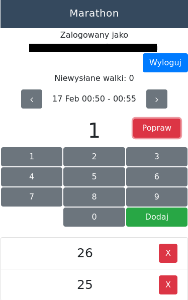

My brazilian jiu jistu club <a href="http://zlomiarzteam.pl/">Złomiarz Team</a> has recently organized <a href="https://www.facebook.com/events/403194580227161/">24h brazilian jiu jitsu marathon</a>. I took part in it not only as a competitor, but also as an organizer - I was asked to write an application, that would help to organize it.

<!-- end-excerpt -->

## The marathon

The main purpose of every edition is charitable help. This year it was the fourth edition of the marathon, and we helped <a href="https://zrzutka.pl/zatrzymac-burze-w-glowie-nikosia">Nikoś</a> - a boy with epilepsy.

Rules are simple. There are 288 5-minute rounds one after another. In every round there must be at least one pair fighting on the mat. If this rule is violated, the marathon is immediately stopped. Marathon is won by the person who fought the biggest amount of rounds amongst the participants.

To find out who won, the organizers have to somehow track the amount of rounds fought by each participant. In previous years it looked like this:
* Each participant was assigned a number
* Organizers were walking on the mat, asking verbally every participant for a number, and writing it down on a piece of paper
* Organizers were writing numbers from paper pieces into google docs Sheet
* Sheet did the calculation.

This process was very exhausting and error prone, so after third edition organizers decided to ask software developers training in the team to create some dedicated application. Many people were eager to create the application, but it was short-lived enthusiasm. After initial confusion development team consisted of me and another developer.

## Development

The key feature was to deliver an easy solution to register and count the fights. Final solution consists of 3 applications:
* admin panel for user registration, and displaying the results,
* application for registering fights,
* application in which participants could check their own results.

Applications were written as [PWA](https://developers.google.com/web/progressive-web-apps/) using [React](https://reactjs.org/), because we already knew React, and we didn't want to build our application for multiple platforms (IOS, Android).

Instead of writing backends we used [firebase](https://firebase.google.com/). This platform makes development of serverless applications very easy. We chose it, because we didn't want to maintain our own infrastructure, and it has very low learning curve comparing to other serverless platforms we know. We used:
* realtime database to store the results,
* google sign-in to authenticate organizers,
* functions for server side computations,
* hosting to deliver our frontends.

Application for registering fights looks like this. Primitive, but does the job:

Organizers were walking on the mat with their smartphones. Verbally asking participants for their numbers and writing them into the app. App wrote those numbers as events into the realtime database. Events consisted of:
* type - register, or remove fight,
* round,
* participant number.

Apart from that we implemented two functions.
* First one was called after every event was created. Basing on event type it set or unset the flag for specified participant and round.
* Second one was watching for set / unset flags for each participants. It counted the amount of their fights and wrote it into the database.

Basing on amounts written by the second function we could calculate the ranking. We did it in our frontend apps.

We secured parts of the database containing flags, and amounts of fights. Those parts could be only written by functions which were run on the server side.

## Production run

On the day of the marathon I sat with my laptop near the mat, and watched how the system performed. We did some manual tests prior the marathon, but I was stressed anyway. I could watch the changes in the database live. It was fascinating to see events transformed into flags, and flags counted into sums which appeared in the ranking.

We had a bug in app for participants. Results were badly sorted. I fixed the bug during the marathon. After that the whole system worked. We haven't found more bugs during the marathon.

I found youtube [video](https://www.youtube.com/watch?v=ibUL80-hqrY) with part of the marathon. You can see some fights and organizers walking with the smartphones.

After I spent some time watching how the system is performing, I put my gi (kimono) on and I did some fights. I didn't do much, because most of my energy was consumed by the stress. All my fights were registered in the system.

## After the marathon

The marathon ended. We received positive feedback, and some suggestions to improve the app.

We plan another edition of the marathon next year. Before that we'll investigate if we can use RFID tags to make the process even easier. Now organizer has to verbally ask participant for his number. Instead of that he could read RFID tag located on his wrist or ankle.

I had much fun doing this project. Application that I participated in, helped in charity event. I learned more React, and some firebase. I plan to continue using this stack in the future.

Code is available on github [jpodeszwik/marathon](https://github.com/jpodeszwik/marathon).
